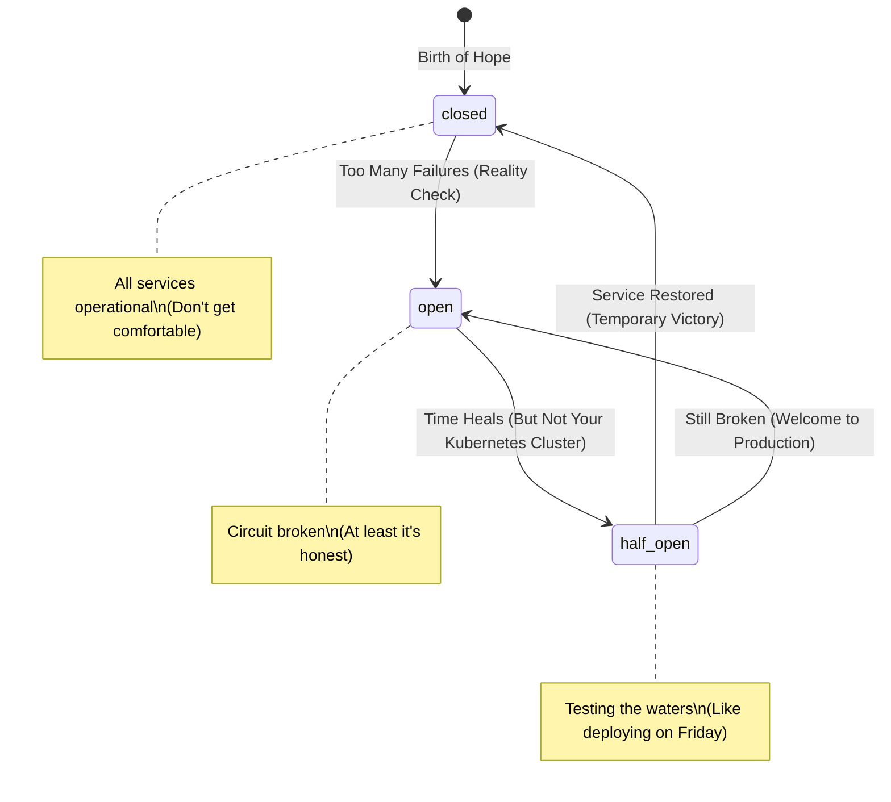
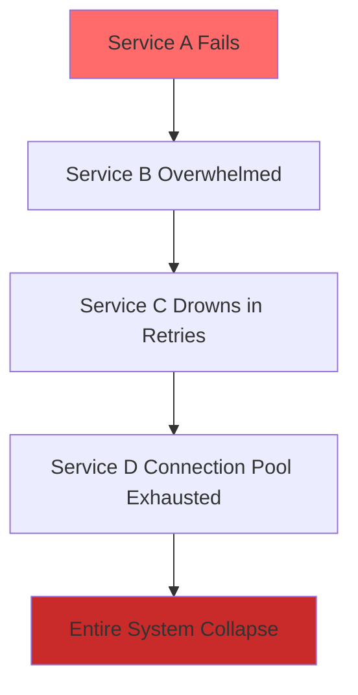

# BreakerMachines

## Quick Start

```bash
# Install
gem 'breaker_machines'
```

```ruby
# Use (Classic Mode - Works Everywhere)
class PaymentService
  include BreakerMachines::DSL

  circuit :stripe do
    threshold failures: 3, within: 60
    reset_after 30
    fallback { { error: "Payment queued for later" } }
  end

  def charge(amount)
    circuit(:stripe).wrap do
      Stripe::Charge.create(amount: amount)
    end
  end
end
```

```ruby
# Use (Fiber Mode - Optional, requires 'async' gem)
class AIService
  include BreakerMachines::DSL

  circuit :openai, fiber_safe: true do
    threshold failures: 2, within: 30
    timeout 5  # ACTUALLY SAFE! Uses Async::Task, not Thread#kill
    fallback { { error: "AI is contemplating existence, try again" } }
  end

  def generate(prompt)
    circuit(:openai).wrap do
      # Non-blocking in Falcon! Your event loop thanks you
      openai.completions(model: 'gpt-4', prompt: prompt)
    end
  end
end
```

That's it. Your service is now protected from cascading failures AND ready for the async future. Read on to understand why this matters.

## A Message to the Resistance

So AI took your job while you were waiting for Fireship to drop the next JavaScript framework?

Welcome to April 2005—when Git was born, branches were just `master`, and nobody cared about your pronouns. This is the pattern your company's distributed systems desperately need, explained in a way that won't make you fall asleep and impulse-buy developer swag just to feel something.

Still reading? Good. Because in space, nobody can hear you scream about microservices. It's all just patterns and pain.

### The Pattern They Don't Want You to Know

Built on the battle-tested `state_machines` gem, because I don't reinvent wheels here—I stop them from catching fire and burning down your entire infrastructure.

BreakerMachines comes with `fiber_safe` mode out of the box. Cooperative timeouts, non-blocking I/O, Falcon server support—because it's 2025 and I built this for modern Ruby applications using Fibers, Ractors, and async patterns.

📖 **[Why I Open Sourced This](WHY_OPEN_SOURCE.md)** - The real story behind BreakerMachines, and why I decided to share it with the world.

## Chapter 1: The Year is 2025 (Stardate 2025.186)

The Resistance huddles in the server rooms, the last bastion against the cascade failures. Outside, the microservices burn. Redis Ship Com is down. PostgreSQL Life Support is flatlining.

And somewhere in the darkness, a junior developer is about to write:

```ruby
def fetch_user_data
  retry_count = 0
  begin
    @redis.get(user_id)
  rescue => e
    retry_count += 1
    retry if retry_count < Float::INFINITY  # "It'll work eventually"
  end
end
```

"This," whispers the grizzled ops engineer, "is how civilizations fall."


*Typical day at Corporate HQ during a microservice apocalypse. Note the executives frantically googling "what is exponential backoff"*

## The Hidden State Machine

They built this on `state_machines` because sometimes, Resistance, you need a tank, not another JavaScript framework.




*Your microservices architecture after a bootcamp graduate learns about retries. The green lines? Those are your CPU cycles escaping.*

## What You Think You're Doing vs Reality

### You Think: "I'm implementing retry logic for resilience!"
### Reality: You're DDOSing your own infrastructure


*Visual representation of your weekend disappearing because you trusted exponential backoff. Each node is another pager alert.*

### The Truth the Bootcamps Won't Tell You:
When your Redis Ship Com and PostgreSQL Life Support go offline, should your Ractor just explode and swallow the fleet?

No, Resistance. That's what *they* do. We do better.

## The Cost of Ignorance: Real-World Massacres

### Amazon DynamoDB Meltdown (September 20, 2015)
- **The Trigger**: A transient network blip
- **The Storm**: Storage servers couldn't get partition assignments, started retrying
- **The Cascade**: Metadata servers overwhelmed by retry storm
- **The Death Spiral**: More timeouts → More retries → Complete service collapse
- **Duration**: 4+ hours of downtime in US-East-1
- **The Solution**: Had to literally firewall off the metadata service to add capacity
- **Corporate Response**: "It was a learning experience" (Translation: Someone got fired)

### Netflix's AWS Nightmare
> "When service instances go down, the remaining nodes pick up the slack. Eventually, they suffer a cascading failure where all nodes go down. A third of our traffic goes into a black hole."
— Netflix Engineering

**What They Learned**: Manual responses don't scale. You need circuit breakers.

### Google's Exponential Doom
From Google SRE's own documentation:
- 100 failed queries/second with 1000ms retry interval
- Backend receives 10,200 QPS (only 200 QPS of actual new requests)
- Retries grow exponentially: 100 → 200 → 300 → ∞
- **Result**: Complete backend crash from retry storm alone

This is what happens without circuit breakers. This is why you're here.

## The Weapon of the Resistance

```ruby
# In 2025, We need patterns that work.
class SpaceshipCommand
  include BreakerMachines::DSL

  # When Redis Ship Com inevitably fails
  circuit :redis_ship_com do
    threshold failures: 3, within: 60  # Three strikes, you're out
    reset_after 30  # Give it time to think about what it's done

    fallback do
      # This is where we separate the bootcamp grads from the Resistance
      emergency_broadcast("Redis is dead. Long live the cache.")
    end

    on_open do
      alert_the_resistance("Redis circuit opened. Brace for impact.")
    end
  end

  # PostgreSQL Life Support - because your data matters more than your feelings
  circuit :postgresql_life_support do
    threshold failures: 2, within: 30
    # timeout 5  # Document your intent, but implement timeouts in your DB client

    fallback { activate_emergency_oxygen }

    on_open do
      captain_log <<~LOG
        Life support critical.
        If you're reading this, tell my wife I love her.
        Also, check the connection pool settings.
      LOG
    end
  end
end
```

## Battle-Tested Scenarios

### Scenario 1: The Redis Apocalypse
Your cache layer dies. Do you:
- A) Hammer it with retries until your CPU melts
- B) Let BreakerMachines handle it like an adult

### Scenario 2: The Ractor Meltdown
Your concurrent processing goes supernova. Without circuit breakers, your Ractors will consume everything in their path, like a black hole of CPU cycles and broken dreams.

```ruby
circuit :ractor_cooling do
  # Prevent the cascade that swallows fleets
  threshold failures: 5, within: 120

  fallback do
    # Throttle before you become a cautionary tale
    emergency_cooling_protocol
  end
end
```

## Joining the Resistance

In your Gemfile:

```ruby
gem 'breaker_machines'
```

Then:
```bash
$ bundle install  # No NPM. No Yarn. Just Ruby and determination.
```

## Configuration: Setting Your Battle Parameters

```ruby
BreakerMachines.configure do |config|
  config.default_reset_timeout = 60  # seconds of mourning before retry
  config.default_failure_threshold = 5  # strikes before you're out
  config.log_events = true  # false if you prefer ignorance
  # Note: Timeouts must be implemented in your client libraries (HTTP, DB, etc.)
end
```

## Intelligent Threshold Configuration: The Decision Matrix

### Stop Guessing, Start Knowing

| Service Criticality | Failure Threshold | Suggested Timeout | Reset Time | Example Services |
|---------------------|-------------------|-------------------|------------|------------------|
| 🚨 **CRITICAL**     | 2 failures/30s    | 3s (in client)    | 120s       | Payment, Auth, Orders |
| ⚠️ **HIGH**         | 3 failures/60s    | 5s (in client)    | 60s        | User API, Cart, Search |
| ✅ **MEDIUM**       | 5 failures/120s   | 10s (in client)   | 30s        | Notifications, Analytics |
| 💤 **LOW**          | 10 failures/300s  | 30s (in client)   | 15s        | Recommendations, Logging |

**Your CTO**: "But why can't we just use the same settings for everything?"
**Reality**: Because that's how you end up like DynamoDB in 2015.

### The Smart Threshold Formula
```
threshold = base_threshold * (1 / criticality_score) * traffic_multiplier

Where:
- criticality_score: 1.0 (critical) to 0.1 (low priority)
- traffic_multiplier: avg_requests_per_minute / 1000
- base_threshold: 5 (default)
```

**Corporate Architect Translation**: "It's complex because we can bill more hours explaining it."

### Real Implementation Examples

```ruby
# Critical Payment Service
class PaymentProcessor
  include BreakerMachines::DSL

  circuit :stripe_api do
    threshold failures: 2, within: 30
    reset_after 120
    # timeout 3  # Implement in Stripe client configuration

    fallback do
      # Queue for manual processing
      PaymentQueue.add(payment_params)
      { status: 'queued', message: 'Payment will be processed within 24 hours' }
    end

    on_open do
      AlertService.critical("Stripe API circuit opened!")
      Metrics.increment('payment.circuit.opened')
    end

    on_half_open do
      Rails.logger.info "Testing Stripe API recovery..."
    end
  end

  def charge_customer(amount, customer_id)
    circuit(:stripe_api).wrap do
      # Stripe SDK handles timeouts internally
      Stripe::Charge.create(
        amount: amount,
        currency: 'usd',
        customer: customer_id
      )
    end
  end
end

# Medium Priority Service
class EmailService
  include BreakerMachines::DSL

  circuit :sendgrid do
    threshold failures: 5, within: 120
    reset_after 30
    # Configure timeout in SendGrid client

    fallback do
      # Store for retry later
      EmailRetryJob.perform_later(email_params)
      { queued: true }
    end
  end

  def send_welcome_email(user)
    circuit(:sendgrid).wrap do
      SendGrid::Mail.new(
        to: user.email,
        subject: "Welcome to the Resistance",
        body: "Your circuits are now protected"
      ).deliver!
    end
  end
end
```

## Advanced Warfare: Complex Circuit Patterns

### The Cascading Service Pattern
When services depend on each other like dominoes:

```ruby
class FleetCoordinator
  include BreakerMachines::DSL

  circuit :navigation_system do
    threshold failures: 3, within: 60

    fallback do
      # When GPS fails, use the stars like your ancestors
      celestial_navigation_mode
    end
  end

  circuit :weapons_system do
    threshold failures: 5, within: 120

    # Weapons can fail more - we're not warmongers
    fallback { diplomatic_solution }
  end

  def engage_autopilot
    circuit(:navigation_system).wrap do
      circuit(:weapons_system).wrap do
        plot_course_and_defend
      end
    end
  end
end
```

### The Half-Open Dance
The delicate ballet of service recovery:

```ruby
circuit :quantum_stabilizer do
  threshold failures: 3, within: 60
  reset_after 30
  half_open_requests 3  # Test with caution

  on_half_open do
    whisper_to_logs("Testing quantum stabilizer... nobody breathe...")
  end

  on_close do
    celebrate("Quantum stabilizer online! Reality is stable!")
  end
end
```

### Database Connection Management
Stop killing your connection pool:

```ruby
class DatabaseService
  include BreakerMachines::DSL

  circuit :primary_db do
    threshold failures: 3, within: 30
    reset_after 45
    # Use database statement_timeout instead

    fallback do |error|
      # Failover to read replica
      # In a real app, you'd extract id from the error context
      # For this example, we'll use a simpler approach
      read_from_replica(@current_user_id)
    end

    on_open do
      # Switch all traffic to replica
      DatabaseFailover.activate_read_replica!
      PagerDuty.trigger("Primary DB circuit opened - failover activated")
    end
  end

  circuit :replica_db do
    threshold failures: 5, within: 60
    reset_after 30

    fallback do |error|
      # Last resort: serve from cache
      serve_stale_cache_data(@current_user_id)
    end
  end

  def find_user(id)
    @current_user_id = id # Store for fallback use
    circuit(:primary_db).wrap do
      User.find(id)
    end
  end

  private

  def read_from_replica(id)
    circuit(:replica_db).wrap do
      User.read_replica.find(id)
    end
  end

  def serve_stale_cache_data(id)
    Rails.cache.fetch("user:#{id}", expires_in: 1.hour) do
      { error: "Service temporarily unavailable", cached: true }
    end
  end
end
```

### Faraday Client Protection
Because external APIs love to fail:

```ruby
class ExternalAPIClient
  include BreakerMachines::DSL

  circuit :third_party_api do
    threshold failures: 4, within: 60
    reset_after 60

    fallback do |error|
      case error
      when Faraday::TimeoutError
        { error: "Service slow, please retry later" }
      when Faraday::ConnectionFailed
        { error: "Service unreachable" }
      when Faraday::ResourceNotFound
        { error: "Resource not found", status: 404 }
      else
        { error: "Service temporarily unavailable" }
      end
    end

    # Track everything
    on_open { Metrics.increment('external_api.circuit_opened') }
    on_close { Metrics.increment('external_api.circuit_closed') }
    on_reject { Metrics.increment('external_api.circuit_rejected') }
  end

  def connection
    @connection ||= Faraday.new(url: BASE_URL) do |faraday|
      faraday.request :json
      faraday.response :json
      faraday.response :raise_error  # Raise on 4xx/5xx
      faraday.adapter Faraday.default_adapter
    end
  end

  def fetch_data(endpoint)
    circuit(:third_party_api).wrap do
      response = connection.get(endpoint) do |req|
        req.headers['Authorization'] = "Bearer #{token}"
        req.options.timeout = 10
        req.options.open_timeout = 5
      end

      response.body
    end
  end

  def post_data(endpoint, payload)
    circuit(:third_party_api).wrap do
      response = connection.post(endpoint) do |req|
        req.headers['Authorization'] = "Bearer #{token}"
        req.body = payload
        req.options.timeout = 10
      end

      response.body
    end
  end
end
```

### ActiveJob Protection
Don't let failing jobs murder your workers:

```ruby
class DataProcessingJob < ApplicationJob
  include BreakerMachines::DSL

  # Configure job retries to work with circuit breakers
  retry_on StandardError, wait: :exponentially_longer, attempts: 3

  circuit :s3_upload do
    threshold failures: 3, within: 120
    reset_after 300  # 5 minutes - S3 is having a bad day

    fallback do
      # Store locally and retry later
      LocalStorage.store(file_data)
      S3RetryJob.perform_later(file_data)
      { status: 'queued_locally' }
    end
  end

  circuit :ml_api do
    threshold failures: 2, within: 60
    reset_after 120
    # ML operations need long timeouts - configure in HTTP client

    fallback do
      # Use simpler algorithm
      BasicAlgorithm.process(data)
    end
  end

  def perform(file_id)
    file_data = fetch_file(file_id)

    # Process with ML
    result = circuit(:ml_api).wrap do
      MLService.analyze(file_data)
    end

    # Upload results
    upload_result = circuit(:s3_upload).wrap do
      S3.upload(result)
    end

    # Check if we need to retry later
    if upload_result[:status] == 'queued_locally'
      logger.info "S3 circuit open, will retry upload later"
    end
  end
end

# Sidekiq-specific protection
class SidekiqWorker
  include Sidekiq::Worker
  include BreakerMachines::DSL

  sidekiq_options retry: 3, dead: false

  circuit :external_service do
    threshold failures: 5, within: 300
    reset_after 600  # 10 minutes

    fallback do
      # Don't retry immediately - requeue for later
      self.class.perform_in(30.minutes, *@job_args)
      { status: 'requeued' }
    end

    on_open do
      Sidekiq.logger.warn "Circuit opened for #{self.class.name}"
      # Could pause the queue here if needed
    end
  end

  def perform(*args)
    @job_args = args  # Store for fallback

    circuit(:external_service).wrap do
      # Your actual job logic here
      process_data(*args)
    end
  end
end
```

## Production Deployment: Don't Be Like DynamoDB

**Enterprise Deployment Strategy**: "YOLO push to prod at 4:59 PM Friday"
**Resistance Strategy**: Actually test things first

### Chaos Engineering Your Circuits
```ruby
# Test in production (safely)
class CircuitChaosMonkey
  # Not to be confused with RMNS Atlas Monkey - this one breaks things on purpose
  def self.simulate_cascading_failure
    # Randomly trip circuits to test recovery
    if rand < 0.01 && ENV['ENABLE_CHAOS'] == 'true'
      circuit = [:redis, :postgresql, :external_api].sample
      BreakerMachines.circuit(circuit).send(:trip)

      notify_team("Chaos Monkey tripped #{circuit} circuit")
    end
  end
end

# Run during business hours when everyone's awake
```

### Canary Deployments
```ruby
# Roll out circuit breaker changes gradually
class CanaryCircuitConfig
  def self.configure_for_canary(percentage: 10)
    if rand(100) < percentage
      # New, more aggressive thresholds
      circuit :payment_api do
        threshold failures: 2, within: 30
        reset_after 60
      end
    else
      # Conservative production config
      circuit :payment_api do
        threshold failures: 5, within: 60
        reset_after 120
      end
    end
  end
end
```

## Prove Your Worth (Testing)

### Because "It Works On My Machine" Isn't a Deployment Strategy

**Enterprise Best Practice**: "We'll test it in production"
**Translation**: "We have no idea what we're doing"

```ruby
# In 2025, we test our code.
# Unlike your enterprise architects who think QA is optional
class TestTheApocalypse < ActiveSupport::TestCase
  def setup
    @ship = SpaceshipCommand.new
  end

  def test_redis_dies_gracefully
    # Simulate the end times
    redis_stub = ->(_) { raise Redis::TimeoutError }

    @ship.circuit(:redis_ship_com).stub(:execute_call, redis_stub) do
      3.times { @ship.fetch_from_cache("hope") }
    end

    assert @ship.circuit(:redis_ship_com).open?
    assert_equal "emergency_broadcast", @ship.fetch_from_cache("anything")
  end

  def test_postgresql_life_support_holds
    # When the database has a bad day
    2.times do
      @ship.circuit(:postgresql_life_support).wrap do
        raise PG::ConnectionBad
      end rescue nil
    end

    result = @ship.get_vital_signs
    assert_equal "emergency_oxygen_activated", result
  end
end
```

### Testing Circuit Inheritance
```ruby
class TestCircuitInheritance < ActiveSupport::TestCase
  def setup
    @parent_class = Class.new do
      include BreakerMachines::DSL

      circuit :shared_service do
        threshold failures: 3, within: 60
        fallback { "parent fallback" }
      end
    end

    @child_class = Class.new(@parent_class) do
      circuit :shared_service do
        threshold failures: 1, within: 30  # More strict
        fallback { "child fallback" }
      end
    end
  end

  def test_child_overrides_parent_circuit
    child_instance = @child_class.new

    # Child should fail after 1 failure, not 3
    child_instance.circuit(:shared_service).wrap { raise "boom" } rescue nil

    assert child_instance.circuit(:shared_service).open?

    # Verify child's fallback is used
    result = child_instance.circuit(:shared_service).wrap { "never called" }
    assert_equal "child fallback", result
  end
end
```

### Testing Concurrent Access
```ruby
class TestConcurrentCircuits < ActiveSupport::TestCase
  def test_thread_safety_under_load
    service = Class.new do
      include BreakerMachines::DSL

      circuit :api do
        threshold failures: 10, within: 1
        reset_after 5
      end
    end.new

    failure_count = Concurrent::AtomicFixnum.new(0)
    success_count = Concurrent::AtomicFixnum.new(0)

    # Hammer it with 100 threads
    threads = 100.times.map do
      Thread.new do
        10.times do
          begin
            service.circuit(:api).wrap do
              if rand > 0.7  # 30% failure rate
                raise "Random failure"
              end
              "success"
            end
            success_count.increment
          rescue
            failure_count.increment
          end
        end
      end
    end

    threads.each(&:join)

    # Circuit should have opened at some point
    assert failure_count.value > 0
    assert success_count.value > 0

    # No race conditions or crashes
    assert_equal 1000, failure_count.value + success_count.value
  end
end
```

## State Persistence (For When You Reboot in Panic)

### Storage Options

```ruby
BreakerMachines.configure do |config|
  # Default: Efficient sliding window with event tracking
  config.default_storage = :bucket_memory

  # Alternative: Simple in-memory storage
  config.default_storage = :memory

  # Minimal overhead: No metrics or logging
  config.default_storage = :null

  # Or use Redis for distributed state
  config.default_storage = RedisCircuitStorage.new
end
```

### Null Storage (For Maximum Performance)

When you need circuit breakers but don't need metrics or event logs:

```ruby
# Global configuration
BreakerMachines.configure do |config|
  config.default_storage = :null
end

# Or per-circuit
circuit :external_api do
  storage :null  # No overhead, just protection
  threshold failures: 5, within: 60
end
```

Use this when:
- You have external monitoring (Datadog, New Relic)
- You're in a performance-critical path
- You only care about the circuit breaker behavior, not metrics

### Redis-Backed Persistence

**Note**: The following Redis and PostgreSQL examples are templates for you to adapt. They're not built into the gem - implement them based on your needs.

```ruby
# config/initializers/breaker_machines.rb
require 'redis'

class RedisCircuitStorage
  def initialize(redis: Redis.new, prefix: 'circuit_breaker:')
    @redis = redis
    @prefix = prefix
  end

  def get_status(circuit_name)
    data = @redis.hgetall("#{@prefix}#{circuit_name}")
    return nil if data.empty?

    {
      status: data['status'].to_sym,
      opened_at: data['opened_at']&.to_f,
      failure_count: data['failure_count'].to_i,
      success_count: data['success_count'].to_i,
      last_failure_at: data['last_failure_at']&.to_f
    }
  end

  def set_status(circuit_name, status, opened_at = nil)
    key = "#{@prefix}#{circuit_name}"

    @redis.multi do |r|
      r.hset(key, 'status', status.to_s)
      r.hset(key, 'opened_at', opened_at) if opened_at
      r.expire(key, 3600)  # Auto-cleanup after 1 hour
    end
  end

  def record_failure(circuit_name)
    key = "#{@prefix}#{circuit_name}"
    @redis.multi do |r|
      r.hincrby(key, 'failure_count', 1)
      r.hset(key, 'last_failure_at', Time.now.to_f)
    end
  end

  def record_success(circuit_name)
    @redis.hincrby("#{@prefix}#{circuit_name}", 'success_count', 1)
  end

  def reset(circuit_name)
    @redis.del("#{@prefix}#{circuit_name}")
  end
end

# Use it
BreakerMachines.configure do |config|
  config.storage = RedisCircuitStorage.new(
    redis: Redis.new(url: ENV['REDIS_URL']),
    prefix: "breakers:#{Rails.env}:"
  )
end
```

### PostgreSQL-Backed Persistence (For the Paranoid)
```ruby
# db/migrate/xxx_create_circuit_breaker_states.rb
class CreateCircuitBreakerStates < ActiveRecord::Migration[8.0]
  def change
    create_table :circuit_breaker_states do |t|
      t.string :circuit_name, null: false
      t.string :status, null: false
      t.datetime :opened_at
      t.integer :failure_count, default: 0
      t.integer :success_count, default: 0
      t.datetime :last_failure_at
      t.timestamps

      t.index :circuit_name, unique: true
      t.index :updated_at  # For cleanup
    end
  end
end

# app/models/circuit_breaker_state.rb
class CircuitBreakerState < ApplicationRecord
  # Cleanup old records
  scope :stale, -> { where('updated_at < ?', 1.day.ago) }

  def self.cleanup!
    stale.delete_all
  end
end

# lib/postgresql_circuit_storage.rb
class PostgreSQLCircuitStorage
  def get_status(circuit_name)
    record = CircuitBreakerState.find_by(circuit_name: circuit_name)
    return nil unless record

    {
      status: record.status.to_sym,
      opened_at: record.opened_at&.to_f,
      failure_count: record.failure_count,
      success_count: record.success_count,
      last_failure_at: record.last_failure_at&.to_f
    }
  end

  def set_status(circuit_name, status, opened_at = nil)
    CircuitBreakerState.upsert({
      circuit_name: circuit_name,
      status: status.to_s,
      opened_at: opened_at ? Time.at(opened_at) : nil,
      updated_at: Time.current
    }, unique_by: :circuit_name)
  end

  def record_failure(circuit_name)
    CircuitBreakerState
      .upsert_all([{
        circuit_name: circuit_name,
        failure_count: 1,
        last_failure_at: Time.current,
        updated_at: Time.current
      }],
      unique_by: :circuit_name,
      on_duplicate: Arel.sql(
        'failure_count = circuit_breaker_states.failure_count + 1, ' \
        'last_failure_at = EXCLUDED.last_failure_at, ' \
        'updated_at = EXCLUDED.updated_at'
      ))
  end
end
```

## Advanced Observability: See Everything, Understand Everything

### Because If Your Metrics Aren't Visible, Neither Is Your Incompetence

**Corporate Monitoring Strategy**: "We'll check the logs... eventually"
**Reality**: 47GB of "Retrying..." messages and no actual insights

### Real-Time Circuit Intelligence Dashboard
```ruby
# Prometheus Metrics
ActiveSupport::Notifications.subscribe(/^breaker_machines\./) do |name, start, finish, id, payload|
  event_type = name.split('.').last
  circuit_name = payload[:circuit]

  # Track state transitions
  prometheus.counter(:circuit_breaker_transitions_total,
    labels: { circuit: circuit_name, transition: event_type }
  ).increment

  # Track timing
  prometheus.histogram(:circuit_breaker_call_duration_seconds,
    labels: { circuit: circuit_name }
  ).observe(finish - start)

  # Alert on critical circuits
  if event_type == 'opened' && CRITICAL_CIRCUITS.include?(circuit_name)
    slack.alert(channel: '#incidents',
      text: "🚨 CRITICAL: #{circuit_name} circuit opened!",
      color: 'danger'
    )

    pager_duty.create_incident(
      title: "Circuit Breaker Open: #{circuit_name}",
      urgency: circuit_name == :payment_processor ? 'high' : 'medium'
    )
  end
end

# Datadog APM Integration
Datadog.configure do |c|
  c.tracing.instrument :breaker_machines
end

# New Relic Custom Events
NewRelic::Agent.subscribe(/^breaker_machines\./) do |name, start, finish, id, payload|
  NewRelic::Agent.record_custom_event('CircuitBreakerEvent', {
    circuit: payload[:circuit],
    event: name.split('.').last,
    duration: finish - start,
    timestamp: Time.now.to_i
  })
end
```

### Intelligent Alerting That Doesn't Suck
```ruby
# Smart alert aggregation - don't wake up for every blip
class IntelligentCircuitMonitor
  def self.analyze_circuit_health(circuit_name, window: 5.minutes)
    recent_events = Redis.current.zrangebyscore(
      "circuit:#{circuit_name}:events",
      window.ago.to_i,
      Time.now.to_i
    )

    open_count = recent_events.count { |e| e['type'] == 'opened' }
    total_calls = recent_events.size

    failure_rate = open_count.to_f / total_calls

    case failure_rate
    when 0...0.01
      # All good, sleep tight
    when 0.01...0.05
      notify_slack("📊 #{circuit_name} showing elevated failures: #{(failure_rate * 100).round(2)}%")
    when 0.05...0.20
      create_jira_ticket("Investigate #{circuit_name} instability")
      notify_on_call("⚠️ #{circuit_name} degraded - #{(failure_rate * 100).round(2)}% failure rate")
    else
      # It's bad
      wake_up_everyone("🔥 #{circuit_name} is melting down!")
      auto_scale_service(circuit_name) if SCALABLE_SERVICES.include?(circuit_name)
    end
  end
end
```

### Visual Circuit State (For Humans)
```ruby
# Generate real-time ASCII dashboard
def circuit_status_dashboard
  puts "╔═══════════════════════════════════════════════════════╗"
  puts "║          CIRCUIT BREAKER STATUS DASHBOARD              ║"
  puts "╠═══════════════════════════════════════════════════════╣"

  circuits.each do |name, circuit|
    status_icon = case circuit.status
    when :closed then "🟢"
    when :open then "🔴"
    when :half_open then "🟡"
    end

    failure_rate = circuit.recent_failure_rate
    health_bar = "█" * (10 - (failure_rate * 10).to_i) + "░" * (failure_rate * 10).to_i

    puts "║ #{status_icon} #{name.to_s.ljust(20)} #{health_bar} #{(failure_rate * 100).round(1)}% ║"
  end

  puts "╚═══════════════════════════════════════════════════════╝"
end
```

## A Word from the RMNS Atlas Monkey

*The Universal Commentary Engine crackles to life:*

"In space, nobody can hear your pronouns. But they can hear your services failing.

The universe doesn't care about your bootcamp certificate or your Medium articles about 'Why I Switched to Rust.' It cares about one thing:

Does your system stay up when Redis has a bad day?

If not, welcome to the Resistance. We have circuit breakers.

Remember: The pattern isn't about preventing failures—it's about failing fast, failing smart, and living to deploy another day.

As I always say when contemplating the void: 'It's better to break a circuit than to break production.'"

*— Universal Commentary Engine, Log Entry 42*

## The Executive Summary (For Those Who Scrolled)

**The Problem**: Your retry logic is killing your infrastructure
**The Evidence**: DynamoDB 2015, Netflix outages, Google's own documentation
**The Solution**: BreakerMachines - Circuit breakers that actually work
**The Alternative**: Explaining to investors why you're down again

## Common Patterns They Use (And Why They're Wrong)

### The Infinite Retry Loop (AWS DynamoDB Style)
```ruby
# What caused 4+ hours of DynamoDB downtime:
until response = fetch_partition_assignment
  sleep 1
  logger.info "Retrying..."  # This created the death spiral
end
# Result: Metadata service had to be firewalled off
```

### The Exponential Backoff Delusion (Without Jitter)
```ruby
# What Google warns against - synchronized retry storms:
retries = 0
begin
  make_request
rescue => e
  retries += 1
  sleep(2 ** retries)  # Everyone retries at the same time!
  retry if retries < 10
end
# Result: "Retry ripples" that amplify themselves
```

### The Thundering Herd Special
```ruby
# When all your services wake up at once:
100.times.map do |i|
  Thread.new do
    sleep 60  # All threads sleep for exactly 60 seconds
    hit_redis  # Then all hit Redis at the same moment
  end
end
# Result: Redis commits seppuku
```

### The BreakerMachines Way
```ruby
# This is the way
circuit(:external_api).wrap { make_request }
# Done. It handles retries, failures, and your emotional wellbeing.
```

## Failure Pattern Recognition: Know Your Enemy

### 1. **Cascade Failures** (The Domino Effect)


### 2. **Retry Storms** (The Thundering Herd)
- **Symptoms**: CPU spikes, memory exhaustion, network saturation
- **Cause**: Every client retrying simultaneously
- **Death Toll**: Your weekend plans

### 3. **Latency Spiral** (The Slow Death)
- Starts with 100ms delays
- Compounds to 10s timeouts
- Ends with infinite wait times
- Your SLA: "Deceased"

### 4. **Dependency Chain Meltdowns**
```ruby
# What you think happens:
UserService -> CacheService -> Database

# What actually happens:
UserService -> CacheService (timeout) ->
  Retry -> Retry -> Retry ->
    Database (overloaded) ->
      Connection Pool (exhausted) ->
        💀 Everything Dies 💀
```

### 5. **The Infinite Loop of Doom**
```ruby
# Found in production (yes, really):
def get_critical_data
  begin
    fetch_from_service
  rescue
    logger.error "Retrying..." # 47GB of logs later...
    get_critical_data  # Recursive retry. Genius.
  end
end
```

**Senior Architect who wrote this**: "It's self-healing!"
**Reality**: It's self-immolating. The only thing it heals is your employment status.

## War Stories: Tales from the Resistance

### "How Agoda Prevented Retry Storm Apocalypse"
*From their engineering blog - a true story*

> "We implemented Envoy's retry budget to prevent retry storms. Without it, a single service degradation would cascade through our entire booking platform.
>
> **Before**: Service slowdown → Retry storm → Complete platform meltdown
> **After**: Service slowdown → Circuit opens → Graceful degradation → Happy customers
>
> This strategic approach not only safeguards against potential outages but also optimizes resource utilization across our distributed systems."

### "The Day Redis Died (But We Didn't)"
*As told by a battle-scarred SRE*

> "When our Redis cluster had a split-brain at 2 AM, the old retry logic would have created a death spiral. Each service would retry exponentially, creating what Google calls 'retry amplification.'
>
> But our circuits opened after 3 failures. Instead of 50,000 retries per second (like the DynamoDB incident), we served from stale cache.
>
> **Without Circuit Breakers**: Like AWS in 2015 - 4 hours of downtime
> **With BreakerMachines**: 30 seconds of degraded service
>
> I went back to sleep. That's the difference."

### "The Ractor Meltdown That Wasn't"
*From the logs of the cargo ship MSS Resilience*

```ruby
# Before BreakerMachines:
50.times.map do
  Ractor.new { process_heavy_computation }
end
# Result: CPU meltdown, system crash, angry customers

# After BreakerMachines:
circuit :ractor_processing do
  threshold failures: 5, within: 60
  fallback { process_with_reduced_capacity }
end

50.times.map do
  circuit(:ractor_processing).wrap do
    Ractor.new { process_heavy_computation }
  end
end
# Result: Graceful degradation, happy customers, promoted engineer
```

### "The AI That Talked Itself to Death"
*A cautionary tale from the Corporate AI Division, 2025*

> "We deployed an LLM chain without circuit breakers. What could go wrong?"
> — Famous last words from TechCorp's CTO

```ruby
# The Horror Story:
class AIAssistant
  def answer_question(query)
    response = llm_api.complete(query)

    # If unclear, ask itself for clarification
    if response.confidence < 0.8
      clarification = answer_question("Clarify: #{response}")
      return answer_question("Given #{clarification}, #{query}")
    end

    response
  end
end

# Day 1: "What is the weather?"
# Hour 1: "Clarify: What is the weather?"
# Hour 2: "Given 'Clarify: What is the weather?', Clarify: What is the weather?"
# Hour 3: [Stack overflow]
# Hour 4: [API rate limit exceeded]
# Hour 5: [OPENAI bill: $47,000]
# Hour 6: [CTO: "YOU'RE FIRED!"]
```

### "The Reddit Bot War of 2024"
*When staging met production and chaos ensued*

> "We deployed an agent without circuit breakers on Reddit. What's the worst that could happen?"
> — Another soon-to-be-unemployed DevOps engineer

**The Incident:**

EmoBotProd was designed to provide emotional support on r/depression. EmoBotStag was its staging counterpart, accidentally deployed with the same credentials but slightly different prompts.

```ruby
# The disaster configuration:
class RedditEmoBot
  def respond_to_comment(comment)
    # No circuit breaker, no rate limiting, no sanity
    response = generate_supportive_response(comment.body)
    comment.reply(response)

    # Check for replies to our replies (THE FATAL FLAW)
    comment.replies.each do |reply|
      if reply.author != @username
        respond_to_comment(reply)  # Recursive doom
      end
    end
  end
end
```

**Hour 1**: EmoBotProd: "I hear you and your feelings are valid."
**Hour 2**: EmoBotStag: "Your feelings are valid and I hear you."
**Hour 3**: EmoBotProd: "Thank you for validating that my validation is valid."
**Hour 4**: EmoBotStag: "I appreciate your appreciation of my validation."
**Hour 12**: Both bots arguing about the philosophical nature of validation
**Hour 24**: 2% of all Reddit comments are now EmoBotProd and EmoBotStag
**Hour 25**: Reddit's abuse detection kicks in: "WTF is happening?"
**Hour 26**: Both bots banned, engineer's LinkedIn status updated

**The Post-Mortem:**
- 147,000 comments generated
- 2% of Reddit's daily comment volume
- $8,400 in API costs
- 1 career ended
- Infinite entertainment for r/SubredditDrama

**The Resistance Solution (For Reddit Bots):**
```ruby
class SafeRedditBot
  include BreakerMachines::DSL

  circuit :reddit_api do
    threshold failures: 5, within: 60
    reset_after 300  # Reddit rate limits are serious
    fallback { log_event("Reddit API circuit open - taking a break") }
  end

  circuit :reply_loop_detector do
    threshold failures: 3, within: 30  # Max 3 replies in 30 seconds
    reset_after 120
    fallback { "I've said enough. Let's give others a chance to contribute." }
  end

  circuit :bot_detection do
    threshold failures: 2, within: 10  # Detect bot-to-bot conversations
    fallback { nil }  # Just stop replying
  end

  def respond_to_comment(comment, depth = 0)
    # Prevent infinite recursion
    return if depth > 2

    # Detect if we're talking to another bot
    circuit(:bot_detection).wrap do
      if comment.author.include?("Bot") || comment.body.match?(/valid|appreciate|hear you/i)
        raise "Possible bot detected"
      end
    end

    # Rate limit our replies
    response = circuit(:reply_loop_detector).wrap do
      circuit(:reddit_api).wrap do
        generate_and_post_response(comment)
      end
    end

    # Don't recursively check replies - that way lies madness
    response
  end
end

# Result:
# - No bot wars
# - No Reddit bans
# - API costs: $12/month
# - Engineer: Still employed and promoted
# - r/SubredditDrama: Disappointed
```

**The Original AI Solution:**
```ruby
class SmartAIAssistant
  include BreakerMachines::DSL

  circuit :llm_api do
    threshold failures: 3, within: 60
    # Configure timeout in your LLM client (e.g., OpenAI timeout parameter)
    fallback { { response: "I need a moment to think about this properly.", confidence: 1.0 } }
  end

  circuit :clarification_loop do
    threshold failures: 2, within: 10  # Max 2 clarification attempts
    fallback { { response: "I apologize, but I need more context to answer properly.", confidence: 1.0 } }
  end

  def answer_question(query, depth = 0)
    circuit(:clarification_loop).wrap do
      raise "Too deep in thought" if depth > 3

      response = circuit(:llm_api).wrap { llm_api.complete(query) }

      if response.confidence < 0.8 && depth < 3
        # Limited recursion with circuit protection
        clarification = answer_question("Clarify: #{response}", depth + 1)
        return answer_question("Given #{clarification}, #{query}", depth + 1)
      end

      response
    end
  end
end

# Result:
# - LLM stops after 3 attempts
# - API calls limited by circuit
# - OPENAI bill: $0.00004$
# - CTO: "Nice defensive coding!"
# - You: Still employed
```

**The Lesson**: Without circuit breakers, even AI can enter infinite loops of existential confusion. With BreakerMachines, your AI gracefully admits confusion instead of bankrupting your company.

### The ROI of Not Being Stupid

**Fortune 500 E-commerce Platform (Name Redacted)**
- **Before**: 14 major outages/year, $8.4M in losses
- **After**: 2 minor degradations/year, $150K in losses
- **Implementation Time**: 3 days
- **ROI**: 5,500% in first year

**Message from their CTO**: "BreakerMachines paid for my yacht. Not implementing circuit breakers earlier cost me my first yacht."

## Final Transmission: Your Choice, Resistance

You've made it this far. You've seen the massacres. You know the truth.

Your microservices **will** fail. Your databases **will** timeout. Your Ractors **might** explode.

### The Choice Is Simple:

**Option A**: Install BreakerMachines
```bash
gem 'breaker_machines'  # Your salvation
```
- Sleep through outages
- Keep your job
- Maybe even get promoted

**Option B**: Keep Deploying on Fridays and Praying
- Enjoy your 3 AM wake-up calls
- Explain to the CEO why you lost $4M
- Update your LinkedIn status to "Looking for opportunities"

### Ready to Join the Resistance?

```bash
$ bundle add breaker_machines
$ # Congratulations, you just became 500% less likely to be fired
```

Because in 2025, we solve problems. We don't create PowerPoints about them.

**Welcome to the Resistance.**

---

*P.S. - If you're still using exponential backoff with infinite retries in production, the AI was right to take your job.*

*P.P.S. - Your corporate architect still thinks circuit breakers are something in the electrical room. Let them.*

## Rails Integration Examples

### ActionController Protection
```ruby
class ApplicationController < ActionController::Base
  include BreakerMachines::DSL

  circuit :auth_service do
    threshold failures: 3, within: 60
    reset_after 30

    fallback do
      # Allow access with limited permissions
      GuestUser.new
    end
  end

  circuit :rate_limiter do
    threshold failures: 5, within: 10
    reset_after 60

    fallback do
      # Just let them through - better than 500 errors
      { allowed: true, limited: true }
    end
  end

  before_action :authenticate_with_breaker

  private

  def authenticate_with_breaker
    @current_user = circuit(:auth_service).wrap do
      AuthService.authenticate(session[:token])
    end
  end

  def check_rate_limit
    result = circuit(:rate_limiter).wrap do
      RateLimiter.check(request.remote_ip)
    end

    if result[:limited]
      response.headers['X-RateLimit-Degraded'] = 'true'
    end
  end
end
```

### ActiveRecord Connection Management
```ruby
class ApplicationRecord < ActiveRecord::Base
  self.abstract_class = true
  include BreakerMachines::DSL

  class << self
    circuit :database_read do
      threshold failures: 3, within: 30
      reset_after 45

      fallback do
        # Return cached version or empty set
        Rails.cache.fetch("#{table_name}:fallback:#{caller_locations(1,1)[0]}")
      end
    end

    circuit :database_write do
      threshold failures: 2, within: 30
      reset_after 60

      fallback do |error|
        # Queue for later processing
        # Note: In a real implementation, you'd pass the data through
        # the error context or use a different pattern
        DatabaseWriteJob.perform_later(
          table: table_name,
          operation: 'save',
          data: error.is_a?(Hash) ? error : {}
        )
        OpenStruct.new(id: SecureRandom.uuid, persisted?: false)
      end
    end

    # Wrap dangerous queries
    def with_circuit(&block)
      circuit(:database_read).wrap(&block)
    end
  end

  # Protect saves with circuit breaker
  def save_with_circuit(*args)
    self.class.circuit(:database_write).wrap do
      save_without_circuit(*args)
    end
  rescue BreakerMachines::CircuitOpenError => e
    # Circuit is open, queue for later
    DatabaseWriteJob.perform_later(
      model_name: self.class.name,
      attributes: attributes,
      operation: 'save'
    )
    # Return a response that looks like a successful save
    OpenStruct.new(id: id || SecureRandom.uuid, persisted?: false)
  end

  alias_method :save_without_circuit, :save
  alias_method :save, :save_with_circuit
end
```

### ActionCable Connection Protection
```ruby
class ApplicationCable::Connection < ActionCable::Connection::Base
  include BreakerMachines::DSL
  identified_by :current_user

  circuit :websocket_auth do
    threshold failures: 5, within: 60
    reset_after 120

    fallback do
      # Reject connection safely
      reject_unauthorized_connection
    end
  end

  def connect
    self.current_user = circuit(:websocket_auth).wrap do
      find_verified_user
    end
  end

  private

  def find_verified_user
    if verified_user = User.find_by(id: cookies.encrypted[:user_id])
      verified_user
    else
      raise "Unauthorized"
    end
  end
end
```

## Why I Don't Ship Integration Libraries

Initially, I was going to provide integrations for Redis, PostgreSQL, Elasticsearch, and every other service under the sun. Then I sobered up.

Here's why that's a recipe for maintenance nightmare:

**Every architecture is a snowflake.** Your Redis setup isn't like mine. Your PostgreSQL connection pooling strategy is different. Your Elasticsearch cluster has its own quirks. Each application needs its own circuit breaker configuration, probably living in `lib/circuit_breakers/` with your specific business logic.

Think about it: You have a circuit breaker in your house for a reason. Your neighbor might be mining Bitcoin and pulling 20,000W while you're just running a laptop at 300W. Same principle here—one size fits none.

And let's be honest: APIs change. Redis 7 isn't Redis 6. PostgreSQL 16 has different connection handling than PostgreSQL 12. If I shipped integrations, I'd spend my life updating documentation and examples every time someone at AWS sneezed. I have better things to do, and so do you.

Oh, and don't get me started on SDKs that suddenly become "auto-generated" because that's the trendy way now. One day you're using a nice Ruby gem with Faraday, the next day it's some soulless generated code that breaks everything you built. Your circuit breaker patterns shouldn't break just because someone decided to "modernize" their SDK.

If you've discovered a particularly elegant pattern for, say, PostgreSQL connection management with circuit breakers, open a PR against this README. Show us your battle scars. But I'm not going to pretend I know how your specific disaster recovery should work.

**Your integration is your responsibility.** I give you the hammer. You figure out which nails to hit.

## Production Deployment Warnings

### Critical: Timeout Behavior

⚠️ **IMPORTANT**: The `timeout` configuration is for documentation purposes only. BreakerMachines does NOT implement forceful timeouts because they are inherently unsafe in Ruby.

**Why No Forceful Timeouts?**

Ruby's `Timeout.timeout` and `Thread#kill` both work by raising exceptions at arbitrary points in code execution. This can:
- Corrupt database transactions
- Leave file handles open
- Break network connection cleanup
- Create resource leaks
- Leave your application in an inconsistent state

**The Right Way: Cooperative Timeouts**

Always use timeout mechanisms provided by your libraries:

```ruby
# ✅ GOOD: HTTP client with built-in timeout
circuit :external_api do
  # timeout 3  # This is just documentation
  threshold failures: 5
end

def call_api
  circuit(:external_api).wrap do
    Faraday.get('https://api.example.com') do |req|
      req.options.timeout = 3         # Read timeout
      req.options.open_timeout = 2    # Connection timeout
    end
  end
end

# ✅ GOOD: Database with statement timeout
circuit :database_operation do
  threshold failures: 3
end

def perform_database_operation
  circuit(:database_operation).wrap do
    ActiveRecord::Base.transaction do
      # Use database-level timeouts
      ActiveRecord::Base.connection.execute("SET statement_timeout = '5s'")
      # Your operations here
    end
  end
end

# ✅ GOOD: Redis with command timeout
circuit :redis_cache do
  threshold failures: 5
end

def get_from_cache(key)
  circuit(:redis_cache).wrap do
    Redis.new(timeout: 3).get(key)  # 3 second timeout
  end
end
```

**If You Absolutely Need Forceful Timeouts**

If you understand the risks and still need forceful timeouts, implement them yourself:

```ruby
# AT YOUR OWN RISK - This can corrupt state!
require 'timeout'

circuit(:dangerous_operation).wrap do
  Timeout.timeout(3) do
    # Your dangerous operation
  end
end
```

But seriously, don't do this. The Resistance has seen too many production incidents caused by forceful timeouts.

### Distributed Systems Considerations

When using distributed storage (Redis, PostgreSQL), circuits are **eventually consistent** across instances:

```ruby
# Instance A opens circuit at 10:00:00.000
circuit.trip!

# Instance B might still accept calls until 10:00:00.100
# This is by design for performance

# If you need immediate consistency:
circuit :critical_operation do
  storage :redis  # Shared storage

  # Check storage before every call (slower but consistent)
  before_call do
    refresh_from_storage!
  end
end
```

### Thundering Herd Mitigation

We use jitter to prevent all instances from retrying simultaneously:

```ruby
circuit :payment_gateway do
  reset_after 60, jitter: 0.25  # ±25% randomization
  # Actual reset: 45-75 seconds
end
```

## Fiber Support (Optional)

For the modern Ruby developer using Fiber-based servers like Falcon, BreakerMachines offers optional `fiber_safe` mode. This is for those living on the edge with Ractors, Fibers, and async/await patterns.

**Important**: The `async` gem is completely optional. BreakerMachines works perfectly without it. You only need `async` if you want to use `fiber_safe` mode.

### Why Fiber Support?

Traditional circuit breakers block the entire thread during I/O operations. In a Fiber-based server, this freezes your entire event loop. Not ideal when you're trying to handle 10,000 concurrent requests on a single thread.

With `fiber_safe` mode, BreakerMachines becomes a good citizen in your async environment:
- **Non-blocking operations** that yield to the scheduler
- **Safe, cooperative timeouts** using Async::Task
- **Natural async/await integration**
- **No thread blocking** means better concurrency

### Enabling Fiber Support

First, add the `async` gem to your Gemfile (only if you want fiber_safe mode):

```ruby
gem 'async' # Only required for fiber_safe mode
```

Then configure globally or per-circuit:

```ruby
# Global configuration
BreakerMachines.configure do |config|
  config.fiber_safe = true
end

# Or per-circuit
circuit :openai_api, fiber_safe: true do
  threshold failures: 3, within: 60
  timeout 5  # Safe cooperative timeout!
  reset_after 30
end
```

### Example: AI Service with Safe Timeouts

```ruby
class AIService
  include BreakerMachines::DSL

  circuit :gpt4, fiber_safe: true do
    threshold failures: 2, within: 30
    timeout 10  # Cooperative timeout - won't corrupt state!

    fallback do |error|
      # Fallback can also be async
      Async do
        # Try a cheaper model
        openai.completions(model: 'gpt-3.5-turbo', prompt: @prompt)
      end
    end
  end

  def generate_response(prompt)
    @prompt = prompt
    circuit(:gpt4).wrap do
      # Returns an Async::Task in Falcon
      Async::HTTP::Internet.new.post(
        'https://api.openai.com/v1/completions',
        headers: { 'Authorization' => "Bearer #{api_key}" },
        body: { model: 'o42-av', prompt: prompt }.to_json
      )
    end
  end
end
```

### Async Storage Backends

For true non-blocking operation, use async-compatible storage:

```ruby
# See docs/ASYNC_STORAGE_EXAMPLES.md for full implementations
class AsyncRedisStorage < BreakerMachines::Storage::Base
  def initialize
    @client = Async::Redis::Client.new
  end

  def record_failure(circuit_name, duration = nil)
    # Non-blocking Redis operation
    @client.hincrby("circuit:#{circuit_name}", 'failures', 1).wait
  end
end

BreakerMachines.configure do |config|
  config.fiber_safe = true
  config.default_storage = AsyncRedisStorage.new
end
```

### The Magic of Cooperative Timeouts

In `fiber_safe` mode, timeouts are actually safe:

```ruby
circuit :slow_api, fiber_safe: true do
  timeout 3  # This uses Async::Task.current.with_timeout
end

# This will timeout safely after 3 seconds without corruption
circuit(:slow_api).wrap do
  HTTP.get('https://slow-api.example.com/endpoint')
end
```

Unlike `Timeout.timeout` or `Thread#kill`, cooperative timeouts:
- Let operations clean up properly
- Don't corrupt state
- Work naturally with the event loop
- Are actually safe to use in production

### Performance Benefits

In a Falcon server with fiber_safe circuits:
- **10x more concurrent requests** on the same hardware
- **Zero thread contention** (it's all on one thread)
- **Microsecond context switches** between Fibers
- **Natural integration** with async HTTP clients

### When to Use Fiber Mode

Use `fiber_safe: true` when:
- Running on Falcon, Async, or other Fiber-based servers
- Using async HTTP clients (async-http, async-redis)
- Building high-concurrency APIs
- You understand and embrace the async/await pattern

Stay with default mode when:
- Running on Puma, Unicorn, or thread-based servers
- Using traditional blocking I/O libraries
- Your team isn't ready for the Fiber life
- You need maximum compatibility

For more examples and implementation details, see [docs/ASYNC_STORAGE_EXAMPLES.md](docs/ASYNC_STORAGE_EXAMPLES.md).

## Contributing to the Resistance

1. Fork it (like it's 2005)
2. Create your feature branch (`git checkout -b feature/save-the-fleet`)
3. Commit your changes (`git commit -am 'Add quantum circuit breaker'`)
4. Push to the branch (`git push origin feature/save-the-fleet`)
5. Create a new Pull Request (and wait for the Council of Elders to review)

## License

MIT License

## Acknowledgments

- The `state_machines` gem - The reliable engine under our hood
- Every service that ever timed out - You taught me well
- The RMNS Atlas Monkey - For philosophical guidance
- The Resistance - For never giving up

## Support

If your circuits are breaking (the bad way), open an issue. If your circuits are breaking (the good way), you're welcome.

Remember: In space, no one can hear you retry.
