# BreakerMachines Diagrams

This document contains all the technical diagrams and visualizations for BreakerMachines. Because sometimes you need to see the chaos to understand it.

## The Circuit Breaker State Machine

The fundamental state machine that keeps your services from melting down:

## The Retry Death Spiral

What happens when you think retry logic equals resilience:

## Cascade Failure Visualization

The domino effect that turns one small failure into a complete system meltdown:

## Hedged Request Flow

How BreakerMachines implements hedged requests to reduce latency:

## Bulkhead Pattern

Isolating failures to prevent total system compromise:

```mermaid
graph TB
    subgraph "Without Bulkheading"
        A1[Service Pool] --> B1[One Bad Request]
        B1 --> C1[🔥 All Threads Blocked 🔥]
    end

    subgraph "With Bulkheading"
        A2[Service Pool] --> B2[Isolated Compartments]
        B2 --> C2[Limited Blast Radius]
        B2 --> D2[Other Requests Continue]
    end
```

## Production Reality Check

What your architecture looks like vs what actually happens:

---

*Remember: These diagrams aren't just technical documentation—they're warnings from the future.*